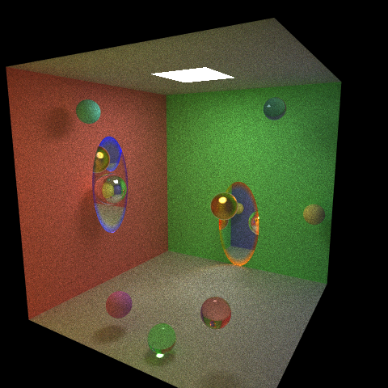

# 太极图形课S1-大作业-光线追踪传送门

## 作业来源
灵感来源于游戏《传送门》，参考《传送门》制作了包含一对传送门的实验室场景。

## 运行方式

#### 运行环境：
```
[Taichi] version 1.1.0, llvm 10.0.0, commit f5bb6464, win, python 3.10.5
[Taichi] Starting on arch=vulkan
```

#### 运行：
```
python 场景0.py
```

## 效果展示

https://www.bilibili.com/video/BV1Ci4y1X7BT/



## 整体结构

### 场景

* **场景0**：测试场景
* **场景1**：简单房间和一堆小球
* **场景2**：两个独立房间，一个有光源一个没光源，明亮房间的光通过传送门照射到黑暗房间。
* **场景3**：激光穿过传送门

### 光线追踪

核心

* **公共**：包含常量、函数
* **场景**：用来存储物体
* **物理**：处理物体间的碰撞
* **投影**：把三维场景投到二维屏幕
* **渲染**：计算光线
* **输出**：输出画面内容
* **总控**：把上面的内容合起来统一控制

物体

* **传送门**
* **球体**
* **矩形**

## 实现细节：

此处省略几万字，具体看《传送门》和《传送门2》的开发者注释吧

## 广告：自制地图

买了《传送门2》的小伙伴可以试一下我做的地图，地图已上传到创意工坊😝

https://steamcommunity.com/sharedfiles/filedetails/?id=1635313683
